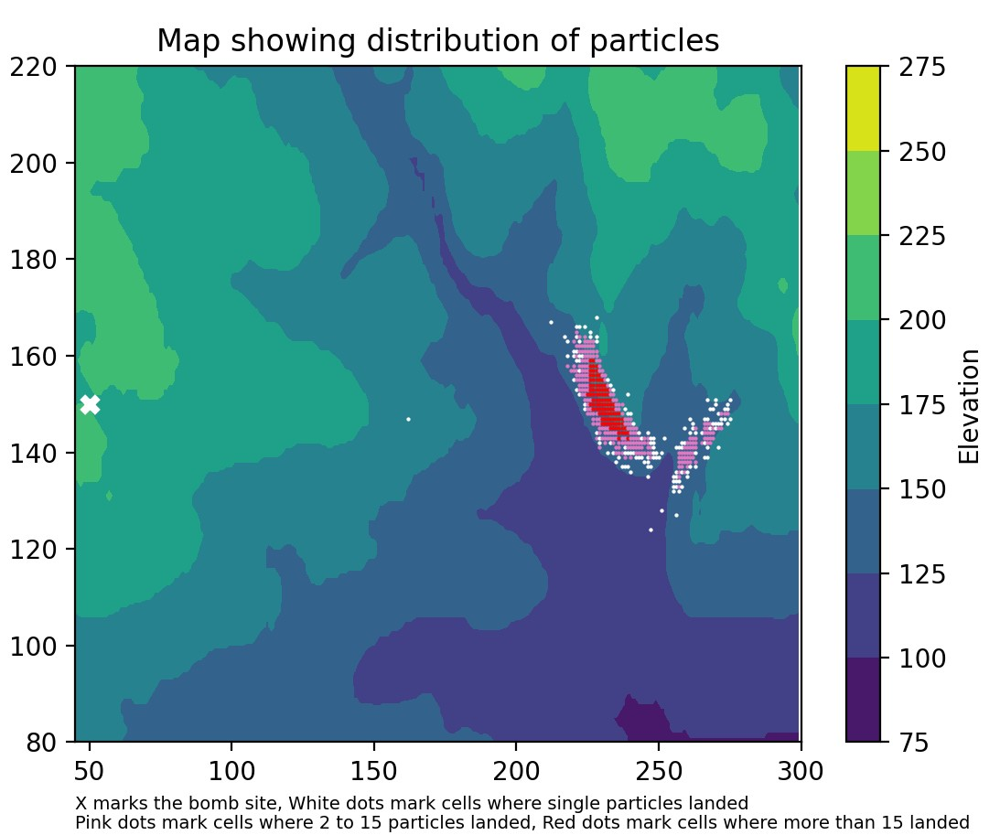

## bacterialbomb

This is a coding project to map the particle fallout from an imaginary bacterial bomb exploded in an urban area. 
It includes two associated python files and a jupyter notebook. The jupyter notebook explains the development of the code and shows some of the ouputs.

### Example output

This is an example of the output that can be produced in bacterial bomb. This shows the particle fallout over a topgraphic surface with 5000 particles and a windspeed of 12.

